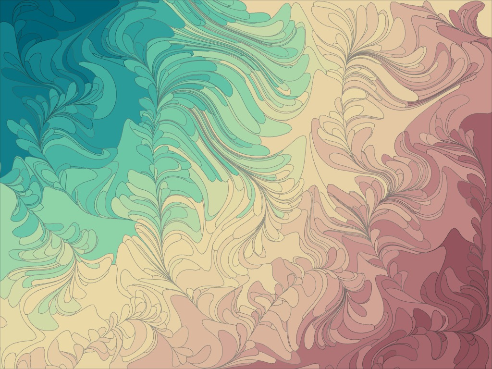

# Perlin Plane



A generative art project that creates complex organic shapes using agents that follow Perlin noise fields to build planar graphs. The result is a collection of interconnected polygons that form intricate, nature-inspired patterns.

## Inspiration

This project is inspired by [Amy Goodchild's blog post on building shapes with planar graphs](https://www.amygoodchild.com/blog/building-shapes-with-a-planar-graph).

## How It Works

The application spawns agents that:
1. Start at random positions on the canvas
2. Follow Perlin noise fields to determine their movement direction
3. Draw paths as they move, creating edges in a planar graph
4. When agents collide with existing paths, they reverse direction
5. Eventually form closed polygons that are filled with colors

## Features

- **Interactive Controls**: Adjust the number of agents, Perlin noise scales, and nudge factors in real-time
- **Multiple Canvas Sizes**: Choose from various aspect ratios including HD, QHD, and square formats
- **Save Functionality**: Export your generated artwork as JPEG images
- **Keyboard Shortcuts**: 
  - `R`: Reset the canvas
  - `A`: Spawn more agents
  - `P`: Toggle Perlin noise visualization
  - `E`: Toggle edge visibility
  - `Space`: Find and fill faces manually
  - `G`: Toggle guide mode
  - `V`: Toggle vertex visibility
  - `B`: Add point at collision (with mouse)
- **Manual Mode**: Click to add points manually and build shapes interactively

## Getting Started

### Prerequisites

- Node.js (version 14 or higher)
- npm or yarn

### Installation

1. Clone the repository:
   ```bash
   git clone <repository-url>
   cd perlin-plane
   ```

2. Install dependencies:
   ```bash
   npm install
   ```

### Running the Project

1. Start the development server:
   ```bash
   npm run dev
   ```

2. Open your browser and navigate to the local development URL (typically `http://localhost:5173`)

3. Use the control panel to adjust parameters and watch as agents create beautiful organic patterns

### Building for Production

```bash
npm run build
```

The built files will be in the `dist` directory.

## Controls

- **Agents**: Number of agents to spawn (10-1000)
- **Perlin Scale X/Y**: Controls the frequency of the noise field (10-500)
- **Nudge Factor**: How much agents deviate from the pure noise field (0-1)
- **Canvas Size**: Various preset sizes for different output formats
- **Save as JPEG**: Export the current artwork
- **Reset**: Clear the canvas and start over

## Technology Stack

- **p5.js**: Creative coding library for rendering and interaction
- **Vite**: Build tool and development server
- **Vanilla JavaScript**: Core application logic
- **HTML5 Canvas**: Rendering target

## License

This project is private and not licensed for distribution.